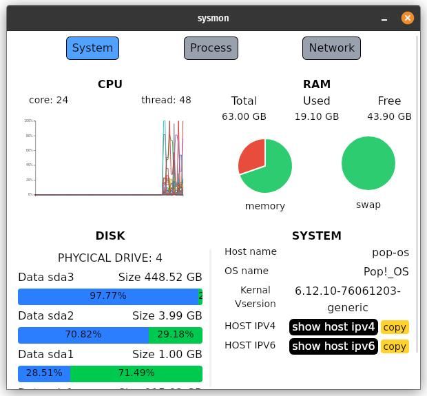
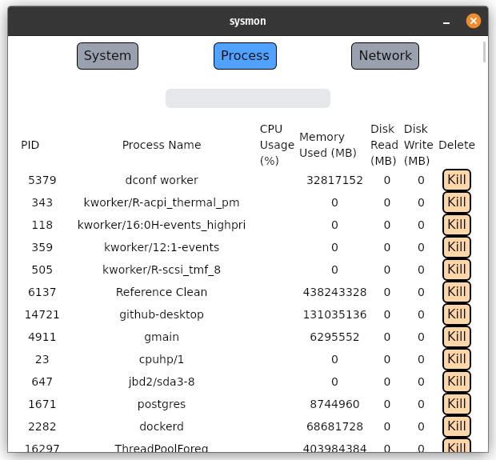
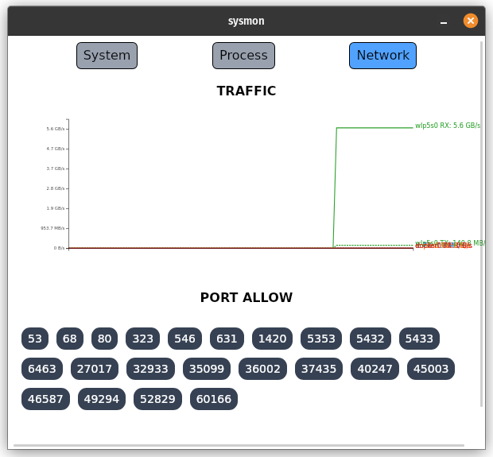

# 🖥️ sysmon

A lightweight, cross-platform system monitor built with **Tauri**, **Rust**, and a modern frontend UI.

## 🚀 Features

- View CPU and memory usage 
- Monitor network traffic (upload/download) by interface  
- Minimal and responsive UI  
- Built using:
  - 🦀 Rust (backend)
  - 🧪 D3.js (for charts)
  - ⚡ Vite (frontend bundler)
  - 🪟 Tauri (for desktop shell)





## 📦 Installation

> Make sure you have Rust, Node.js, and Tauri CLI installed.

```bash
# Clone the repo


# Install frontend dependencies
npm install

# Build the frontend
npm run build

# Build the desktop app
cargo tauri dev
